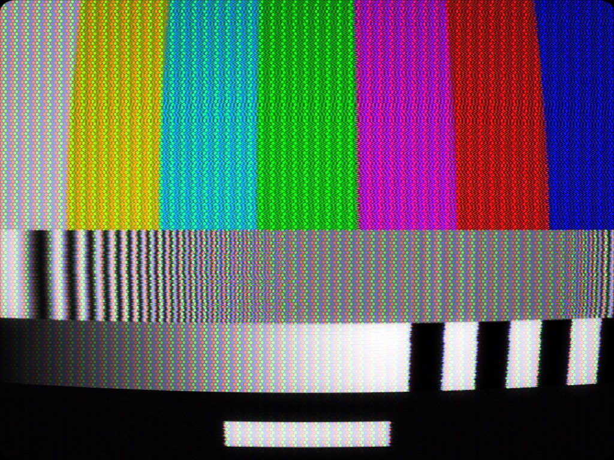
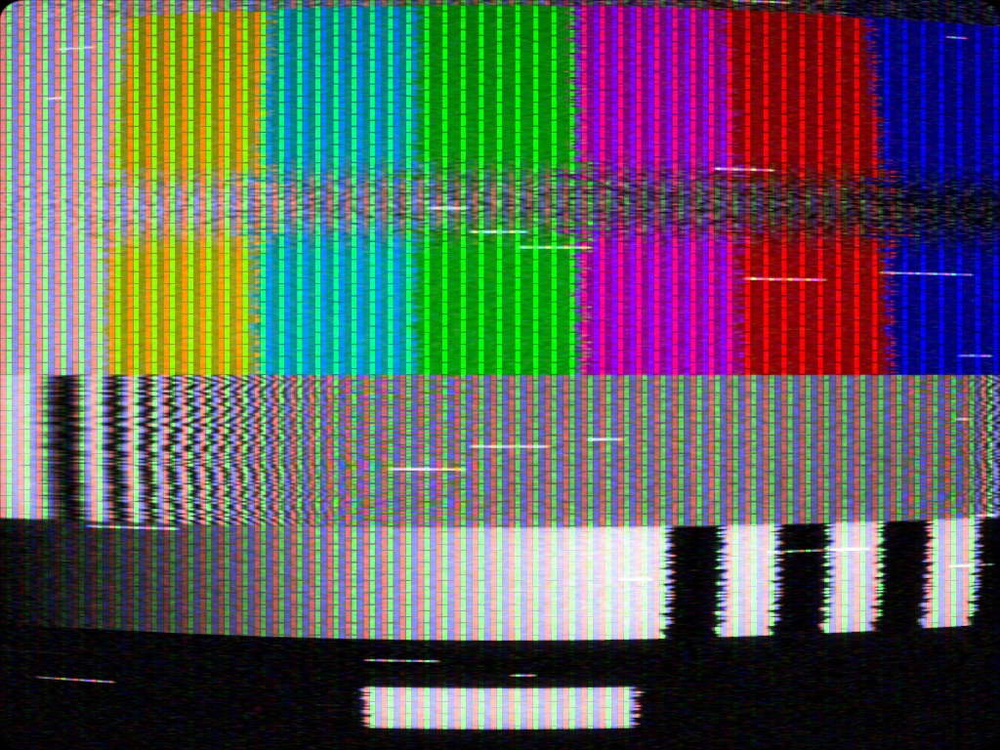
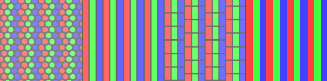
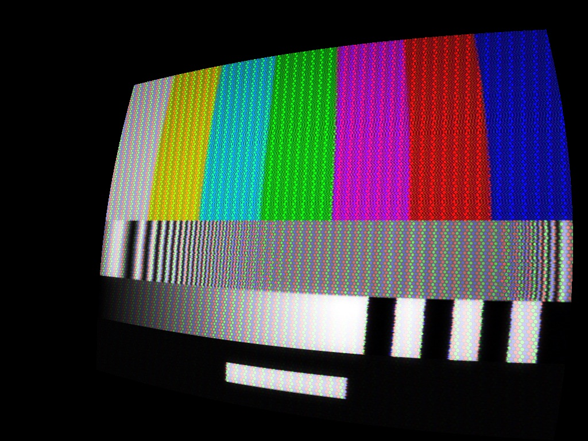

# Old Cathode user guide

Old Cathode is **an analogue television signal path for [Resolume](https://resolume.com) Arena
and Avenue**, as an FFGL effect.

It is not a stack of overlays. It encodes the picture onto a colour subcarrier the way a
broadcast encoder would have, damages the resulting composite waveform **as a single signal**, and
then decodes it again with a synchronous demodulator that has no more information than a real
receiver had. Only then does it paint the result onto a phosphor screen — shadow mask, a beam
that defocuses when it is bright, curved glass, and a viewer sitting somewhere in particular.

> **Before you rely on this:** the signal path is verified numerically through an offline render
> harness that drives the real plugin class in a headless GL context — colour bars round-trip to
> the right hues, mask compensation is measured rather than guessed, and the PAL delay line is
> confirmed to hold hue to 0.0° under a decoder phase error that shifts NTSC by up to 26°. It
> **loads in Resolume Arena 7.27.0 with all six shader stages compiling in the host, and has been
> run there on real content**.
>
> This codebase was created with AI assistance, directed and reviewed by a human author.

---

## Why this matters when you're operating it

Almost everything you recognise as "the CRT look" here is a **consequence** of the signal path
rather than a feature drawn on top. That has one very practical result:

> **The controls interact the way the real thing did.** They are not independent sliders, and
> trying to dial them as if they were will fight you.

Three examples you will meet within five minutes:

- **Turning chroma bandwidth down smears colour sideways *and* reduces cross-colour.** One
  control, two visible effects, because they were always the same trade.
- **Losing signal costs you the colour before it costs you the picture.** Chrominance sits at the
  top of the band and goes under the noise floor first.
- **Switching to PAL changes what Tint does.** A PAL decoder averages each line with the one
  above, so a phase error cancels — in NTSC, Tint rotates every hue; in PAL it costs saturation
  instead.

---

## The four groups are the signal's own order

The inspector groups controls as **Signal → Sync → Tube → Geometry**, which is also the order the
picture travels. Work in that order and each decision stays made; jump around and you will keep
re-tuning things you already set.



**Signal** is the transmission: system, source, bandwidths, and everything that damages the
composite waveform — noise, ghosting, dropouts, interference.

**Sync** is the receiver failing to lock: vertical hold, jitter, tracking, head switch, hum,
interlace.

**Tube** is the display itself: mask, scanlines, beam bloom, persistence, halation.

**Geometry** is the glass and where you're sitting: curvature, corner radius, perspective, zoom,
vignette.

---

## Two settings that are references, not tastes

- **Luma / Chroma Bandwidth: `0.75` is exactly what the standard specifies.** Below that is a
  worse channel than ever shipped; above it is a better one. If you want "correct television"
  rather than "degraded television", that is the number.
- **Saturation, Tint, Brightness, Contrast: `0.5` is unity.** Tint at 0.5 means no phase error at
  all.

Knowing where truth sits makes everything else a deliberate departure from it.

---

## Source: what the tape format actually changes

**Broadcast, VHS SP, VHS LP, VHS EP** set bandwidths, the noise floor, and the **colour-under
delay** — which is why tape colour arrives slightly *after* the luminance it belongs to. That
lag is the single most recognisable "this is a VHS" cue, and you get it from the Source control
alone rather than by offsetting anything by hand.



**Head Switch** deserves a note: the tear normally sits just below the bottom of a correctly
set-up picture, which is why it is normally invisible. Bringing it into frame is a deliberate
"badly adjusted set" move, not a default.

---

## The mask lives on the glass



- **Shadow Mask** — delta triad of round dots; the consumer television mask.
- **Aperture Grille** — continuous vertical stripes, plus the two damper wires that give a
  Trinitron away.
- **Slot Mask** — stripes broken into staggered slots.
- **RGB Stripe** — hard-edged; not a real mask, but legible at pitches where the others turn to
  mush.

> **The mask is on the glass, not on the picture.** It foreshortens with the tube under
> perspective and **stays put when the picture moves**. That is why a pan looks right rather than
> dragging a texture along with it.

**Mask Pitch is in output pixels.** At a low output resolution a realistic pitch turns to
aliasing porridge — that is when RGB Stripe earns its place.

**Beam Bloom** is not a glow filter: the beam is a spot with a Gaussian profile that gets
*fatter where it is brighter*, because more current defocuses it. Highlights swell into the mask
gaps; shadows do not.

---

## Compositing



**Outside the tube face the effect outputs transparent, not black.** You can composite a
television over whatever is on the layer below — a room, a stand, a wall of other sets — without
keying anything out.

---

## Installing

Drop the plugin into Resolume's plugin folder and restart it:

```
macOS    ~/Documents/Resolume Arena/Extra Effects/
Windows  %USERPROFILE%\Documents\Resolume Arena\Extra Effects\
```

Avenue uses the same layout under its own folder name. It appears as **Old Cathode**.

**Needs Resolume Arena or Avenue 7.3.1 or newer.** The macOS builds are Developer ID-signed and
notarised and simply load; the Windows builds are unsigned, but only the installer trips
SmartScreen — see [UNSIGNED.md](UNSIGNED.md).

### OpenFX hosts (Resolve, Vegas, Nuke, Natron)

Old Cathode also ships as an OpenFX plugin — same signal path, same controls.
Copy `OldCathode.ofx.bundle` from the `-ofx-` download into the OpenFX folder
and restart the host:

```
macOS    /Library/OFX/Plugins/
Windows  C:\Program Files\Common Files\OFX\Plugins\
```

One difference worth knowing: Persistence is rebuilt from previous frames each
render, so very high settings cost render time and truncate the longest trails
slightly compared with the Resolume build.

---

## Looking at it without Resolume

`octest` renders the real chain to a PNG through a headless GL context, driving the actual plugin
class through the actual FFGL entry sequence — so it tests the shipped code rather than a copy.

```bash
./build/octest --out /tmp/frame.png --width 1920 --height 1080
```

Every image in this guide was made that way.

---

## Audio reactivity

Every slider here is a plain float, which means Resolume can drive any of them from its own
audio analysis: click the dropdown beside a parameter, choose **FFT**, and pick a frequency
band and gain. No plugin setting is involved — this is the host animating the control for you.

The ones that repay it are the *signal-path degradations*, because a transmission that gets
worse when the music gets loud reads as the broadcast struggling rather than as an effect:

- **Interference** or **Noise** on the low band — the picture breaks up on the kick.
- **Jitter** or **Vertical Hold** on a tight bass band, with the gain low: the frame trembles
  on hits, and at higher gain it loses lock entirely.
- **Ghosting** on overall level, for a signal that smears as the mix fills up.

Drive one or two, not five. Each of these is a *cause* in the signal path, and the picture is
most convincing when only one thing is going wrong at a time.

BPM animation works the same way from the same dropdown — a **Dropouts** ramp that resets each
bar gives a tape that stumbles on the downbeat.

---

## Troubleshooting

| Symptom | Cause |
|---|---|
| **Plugin doesn't appear in Resolume** | Wrong folder, or Resolume older than 7.3.1. An older, pre-notarisation download may still be quarantined, and Resolume skips those silently. |
| **Mask looks like noise** | Mask Pitch is in output pixels and your raster is too small for it. Raise the pitch, or use RGB Stripe. |
| **Colours rotate when I adjust Tint** | Expected in NTSC — Tint is a decoder phase error. In PAL it costs saturation instead. |
| **Colour disappears before the picture does** | Correct. Chrominance is at the top of the band and drowns first. |
| **Colour arrives late, offset from the picture** | Colour-under delay from a VHS Source setting. That is the tape, not a bug. |
| **A tear across the picture I didn't ask for** | Head Switch has been brought up into the visible frame. |
| **Reducing dot crawl softened my picture** | That is the notch filter, and it is the real trade. |
| **Corners are cropped** | Curvature — as on a real tube. Reduce it or zoom out. |
| **Black surround instead of transparency** | Something below in the composite. The effect itself outputs transparent outside the tube face. |

---

## See also

- [README](../README.md) — the full control reference, group by group, and downloads
- [UNSIGNED.md](UNSIGNED.md) — Gatekeeper and SmartScreen
